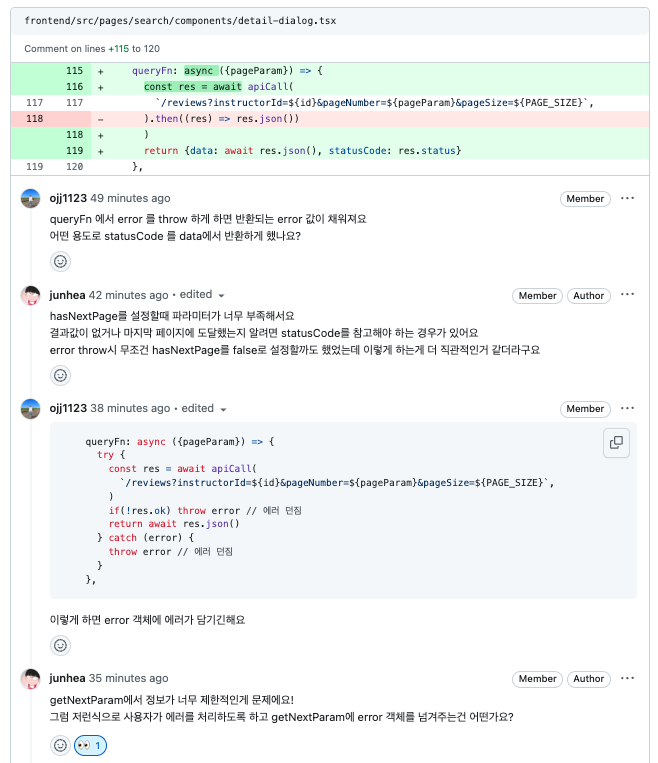

# useInfiniteFetch 에 대한 설계 및 리뷰
## 개요
- 사용자가 에러처리할 수 있는 인터페이스가 없었다
- 처음 `useInfiniteFetch` 를 설계할 때 에러 상황을 고려하지 못했다. 그래서 에러 처리 관련 인터페이스가 없었다.

## 리뷰 과정
> 주제: `queryFn`의 반환값에 `statusCode` 추가

https://github.com/softeerbootcamp-3rd/Team1-driving-today/pull/217#discussion_r1497452682

- 상대 생각: `data` 필드에 `statusCode` 를 추가해 사용자가 에러 코드를 사용해 에처 처리를 할 수 있도록 하자. 또한 hasNextPage(마지막 페이지인지 여부)가 statusCode의 값을 필요로 한다
- 내 생각: hook의 인터페이스가 변경되고 `error` 반환값을 통해서도 에러 핸들링이 가능하다. 또한 statusCode를 반환할 경우 hook 의 인터페이스가 백엔드 API 에 의존되어 재사용성이 떨어지고 유연하지 못하게 된다
- 해결 : `getNextPageParam` 함수에 `error` 객체를 넘겨주어 `hasNextPage` 를 `error`에 따라 결정할 수 있도록 수정하기로 했다. 그러면 `data` 필드는 그대로 유지할 수 있다

