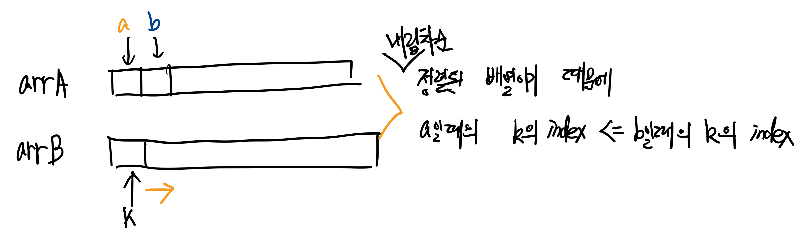

- 2024 카카오 겨울 인턴십 코딩테스트
- 문제 - https://school.programmers.co.kr/learn/courses/30/lessons/258709
- 해설 - https://tech.kakao.com/2023/12/27/2024-coding-test-winter-internship/
- 비슷한 유형
	- [7453번: 합이 0인 네 정수](https://www.acmicpc.net/problem/7453)
		- 정렬된 두 배열에 대해 "합/차/곱/어떠한 연산의 결과가 M이다" 혹은 "두 배열에 대한 비교" 유형 => **이진 탐색 대신 투포인터를 써서 시간복잡도를 줄이는 아이디어**

---
- 완전탐색 문제
- A와 B가 각각 굴린 주사위의 합 배열에서 A가 승리한 경우의 수를 어떻게 셀까?
	- 가장 먼저 두 배열(arrA, arrB 라고 하자)을 정렬함
	- arrA, arrB의 요소 개수가 m이라 하자`
	- A가 이긴 경우의 수를 셀 수 있는 방법은 2가지
		1. 이진탐색 - arrA의 요소 x에 대해 arrB에서 x 보다 작은 원소의 인덱스를 찾음 => A가 이긴 횟수를 구할 수 있음
			- 시간복잡도: `O(m x log m)`
		2. 투포인터 - arrA의 요소를 순회하면서 arrB의 첫번째 요소부터 하나씩 arrB 의 요소가 작은게 나올 때까지 움직임
			- **arrA와 arrB는 정렬된 배열이기에 arrA를 순회하면서 arrB의 요소 처음부터 작은게 나올때까지 arrB의 인덱스를 증가시키지 않아도 됨**
			- 시간복잡도: `O(m)`
			
			