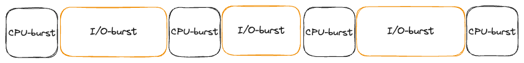

### CPU, I/O
- CPU: 프로세스의 명령어를 해석하고 실행하는 장치
- I/O: 파일을 읽고 쓰거나 네트워크를 통해 데이터를 주고받거나 입출력 장치와 데이터를 주고 받는 것

### CPU-burst and I/O-burst

- burst: 계속되는 작업
- CPU-burst
	- 프로세스가 CPU에서 한번에 연속적으로 실행되는 시간
- I/O-burst
	- 프로세스가 I/O 작업을 요청하고 기다리는 시간
- 프로세스 -> CPU burst와 I/O burst의 연속

### CPU-bound and I/O-bound process

- CPU-bound process: CPU-burst 가 많은 프로세스 -> 긴 CPU-burst
	- 영상 편집 프로그램, 머신 러닝 프로그램, 행렬 계산 -> 연산 작업이 많은 프로세스
- I/O-bound process: I/O-burst 가 많은 프로세스 -> 짧은 CPU-burst
	- 일반적인 백엔드 API 서버 (요청을 받고 -> DB, cache server -> 응답)