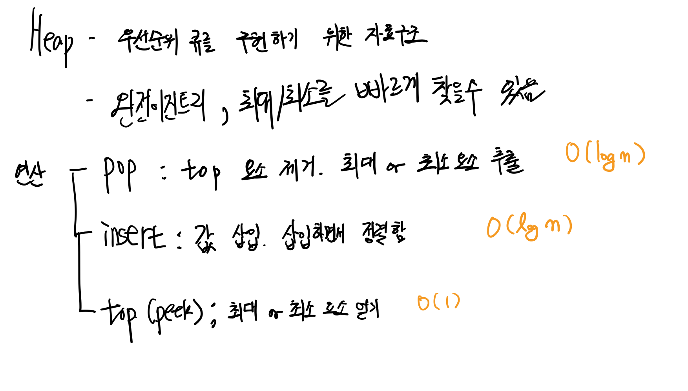

---
links:
  - https://en.wikipedia.org/wiki/Heap_(data_structure)
  - https://github.com/trekhleb/javascript-algorithms/tree/master/src/data-structures/heap
---

# Heap
- heap 의 성질을 가지는 트리 구조의 자료구조
- 우선순위 큐: 우선순위가 가장 높은 혹은 낮은 요소를 front, 가장 앞에 저장하는 자료구조
	- 우선순위가 가장 높은(혹은 낮은)요소가 항상 맨 앞에 있다.

- 두 종류의 heap 이 있다.
	- max heap: 부모 요소의 값이 자식 요소보다 항상 크거나 같다
	- min heap: 부모 요소의 값이 자식 요소보다 항상 작거나 같다
- use case
	- 우선순위가 높거나 낮은 요소를 자주 제거하거나 루트 노드의 제거/삽입이 자주 일어날 때 유용
	- Optimized 다익스트라 알고리즘(최단거리 알고리즘)과 프림 알고리즘(MST 찾는 알고리즘)에서 사용

## Implementation

- By default, Max heap
- [heap.js](./heap.js)
