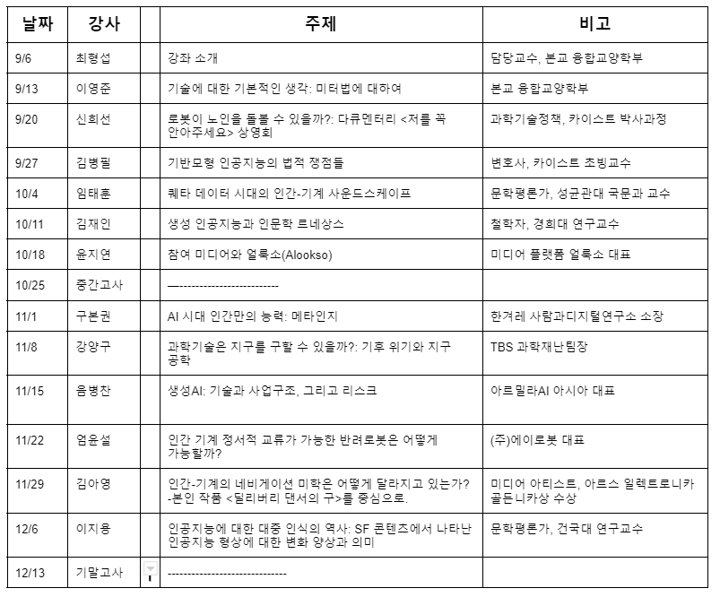

## 혜윰강좌목록

## [2023-09-13](../../0.DailyNote/2023-09-13.md) 이영준 강사 - 기술에 대한 기본적인 생각 : 미터법에 대하여

- 1789 프랑스 혁명 -> 프랑스 인권 선언, 평등, 왕정 폐지 후 공화정 세움, 미터법
- 1790 미터법 제정
- 정확성은 쉽게 얻어지지 않는다
	- 많은 노력이 들여야 한다

## [2023-09-20](../../0.DailyNote/2023-09-20.md) 임태훈 강사 - 퀘타 데이터 시대의 인간-기계 사운드스케이프
- 도서: 블레이드러너 깊이 읽기
- 상상력의 구조 변동을 연구한다
	- 우리의 상상력을 제한하는 것은 무엇인가
	- 우리가 상상할 수 있는것과 없는것은 무엇인가?
- 마케팅이 만들어낸 동선에 갇할 수 밖에 없다 -> 여기서 벗어나보자
	- 프로토룸: 1KB 프로젝트 -> 우리의 상상력 밖에 있는 것들에 우리가 반응할 수 있다는 것이 중요하다
	- 일레트로니코스 - 바코드 펑크
	- 보컬리스트로 성장한 아기 AI: 헌든 - 스폰
- 인간의 재정의
- 동시대의 예술작품에 관심을 가져봐라

## [2023-09-27](2023-09-27) 신희선 - 로봇이 노인을 돌볼 수 있을까? 다큐멘터리 <저를 꼭 안아주세요>
- **chatGPT같은 대화형 AI를 통해 노인과 교류할 수 있을까? 노인의 외로움을 위로해줄 수 있을까?**
- 인상깊은 질문
	- 어르신들의 몸과 마음을 돌보는 좋은 인형 같습니다. 이런 인형은 이질적인 불편함을 제거하는 게 큰 과제라고 생각합니다.귀를 눌렀을 때 아이의 목소리로 ’종료‘라는 음성이 나오며 꺼지는 모습이 ’이 아이는 로봇이다‘. 깨닫게 만드는 것 같습니다. 효돌이가 음식의 레시피를 알려주거나, 투약 시간을 알려주는 기능적인 정보는 살가운 말투로 말을 건냈기 때문에 ’종료‘라는 음성에 더 큰 심리적 거리감을 느꼈습니다. 이에 대한 의견이 궁금합니다.
	- 효돌 로봇에 우울 증상이 개선되신 할머니를 보고 참 안도감이 들다가도 할머님의 로봇에 대한 의존도가 상당히 높아보여 우려도 하게됩니다. iot장비라는 특성으로 인해 서버 오류, 개발관리주체인 주식회사 효돌의 상실등으로 인해 언제든지 어느순간 말이 없어지는 등 여타 다른 인형과 다를 바가 없는 단순 공산품으로의 전락에 상당히 취약해보이는데, 이러한 노인보조장비의 지속에 관해서도 논의가 이루어지는지 궁금합니다
		- 국가의 정책과 제도적인 지원이 필요하다고 생각합니다. 회사가 망하더라도 이런 장비를 유지할 수 있거나 혹은 대체할 수 있는 무언가를 제공해줄 수 있는 인프라가 필요하다고 봅니다

## [2023-10-11](../../0.DailyNote/2023-10-11.md) 김재인 - 생성 인공지능을 대하는 확장된 인문학
- 자국 언어 모델을 가지고 있는 것은 큰 기회이다
	- 자국 언어 모델을 가지고 있는 나라는 미국, 중국, 우리나라 뿐이다.
	- 네이버 클로바X 아직 기술력으로는 부족하지만 개선의 여지는 충분하다
- 인문학의 역할 -> 교육 현장에서 확장된 문해력을 가르치는 것
	- 확장된 문해력: 확장된 언어 (자연어+수학+자연과학+기술+예술+디지털)
- ⭐️ 확장된 문해력의 기대효과 ⭐️
	1. 교육과 재교육을 받을 수 있는 능력을 얻을 수 있다(재교육: 무언가를 다시 배우는 것)
	2. 협업이 가능해진다 -> 대화가 통해야한다
- 내가 필요로 해서 인문학, 예술에 대해 공부해보는 것이 중요
- 그림성생 인공지능의 짧은 생성
	- Stable Diffusion by stability ai
- **어쨌든 우리가 더 많이 공부하고 알고 있어야 한다**
- Gen ai가 만들어주는 결과물의 진위성과 사실을 판가름하기 위해서는 해당 도메인에 대한 전문지식을 많이 알고 있어야 한다.
- 인공지능과 동물의 차이
	- 인공지능은 수행기준이 외부에 존재하고 동물은 수행기준이 내재되어 있다
	- 현재의 인공지능은 인공일반지능(AGI)에 미치지 못했다
- GPT가 할 수 있는것과 할 수 없는 것을 구분해볼 수 있는 시간

- 글쓰기 - 단순히 결과물만 내는 일편적인 작업이라고 이해하면 안되고 **생각의 힘을 키우는 과정이라고 생각해야함**

## [2023-10-18](../../0.DailyNote/2023-10-18.md) 윤지연 - 참여 미디어 얼룩소(Alookso)

## [2023-11-01](../../0.DailyNote/2023-11-01.md) 구본권 - AI시대 인간만의 능력: 메타인지
- 현재 인기 있는 직업이 10년뒤에도 여전히 인기있는 직업일까?
	- AI, 빅데이터, 모바일플랫폼개발자, 메타버스 개발자, 유투버 ... 10년 전에는 없거나 있어도 잘 몰랐던 직업. 현재는 인기 직업이다
- 미래의 "상수"
	- 점점 더 오래살게 되고
	- 초고령화 사회가 되고
	- 기술이 빠르게 발전한다
- 내가 무엇을 잘하는지 모르는지 아는 능력
- 메타인지의 힘
- 두 도시 이야기 - 찰스디킨스
- 읽고 쓰는 능력이 메타인지할 수 있는 시작점
	- 내가 현재 무엇에 영향을 받는지?
	- "내가 누구인지?"
- 아이의 사생활 4부 - 다중지능 2008
- 질문: 넓고 앝은 지식 vs 깊고 좊은 지식
	- 나의 관심과 사회의 흐름의 연결점을 찾는 것이 인공지능 시대에는 중요해질 것이다
	- 사회에 대해 관심을 가지면서 내 전문성을 키워나가는 것이 중요하다

## [2023-11-08](../../0.DailyNote/2023-11-08.md) 강양구 - 과학 기술은 지구를 지킬 수 있을까?
- 과학기술이 지구를 지키려는 사례를 중심으로 한 강연, 스토리텔링이 재미있고
	- 생각해보지 못했던 분야라 흥미롭다
	- 엔지니어를 희망하는 사람으로서 기후 문제 뿐만아니라 주변에서 일어나는 문제를 해결할 수 있는 방법에 대해 고민해보아야 겠다고 생각했다.
- 황우석 박사 논란 최초 보도한 기자
- 기후 위기 관련 기사에서 보이는 숫자 = "1.5도"
	- 왜 1.5도 이지?
	- 1985년 지구 표면 온도 13.7도을 기준으로 1.5도
		- 왜 하필 1985년?
- 호세펠레스
- 오루가가 지구를 지킬 수 있을까
	- 가치가 있는가
	- 빌게이츠는 왜 투자했는가
- 고래의 반전
	- 2톤의 탄소를 심해해 keep 한다..?
- 탄소 추출 방식
- 화산재를 성층권에 뿌리는 방식
- 전기자동차

- 과학기술로 지구를 지키기 위해서는 세심해야 한다
- 독일 윤데 마을 - 가축 빈뇨
- 스웨덴 스톡홀름 중앙역
	- 체열을 이용해 난방효율을 낸 사례
- 과학기술로 지구를 지키는 결이 다른 사례를 보며 어떤 방식으로 지구를 지킬 수 있는지?
	- 엄청난 투자를 받아 만들고 있는 과학기술과 그 사례
	- 적정기술로 실질적으로 도움을 줄 수 있는 과학기술과 그 사례
- 질문: 제가 궁금한건 대기업의 경우 ESG 경영을, 사회적 기업, 스타트업들이 환경을 지켜보자라고 해서 비즈니스 사업을 하고 있는데, 강사님께서 생각하시는 잘 되고 있다고 생각하는 사례나 그렇지 못한 사례(그린워싱)가 있을까요?
	- 우리나라에도 "과학기술로 지구를 지키는" 사례들이 있으려면 누구 하나만 이행해서는 이루어질 수 없다
	- 사회, 정책, 시민, 지역사회 모두가 관심을 가져야 한다
	- 어느 하나만으로는 이루어질 수 없다. 파편적으로 이루어지다보면 결국 지쳐서 아무도 하려하지 않을거다
	- 모두가 함께 하고, 좋은 사례들을 만들고 그런 것들이 넛지효과를 일으키면서 더 좋은 사례들이 생겨날 수 있는 환경을 만들어가야 한다

- 싸바나 채널 - 기후위기와 관련된 컨텐츠
- 팬귄뉴스
- 남종영, 윤신영, 윤지로, 박상옥 기자
	- 윤지로 - <탄소로운식탁> 책 추천

## [2023-11-15](../../0.DailyNote/2023-11-15.md) 음병찬 - 생성AI: 기술과 사업구조, 그리고 리스크
- 아르밀라AI 아시아 대표
	- 생성형 AI의 리스크를 줄일 수 있도록 도와주는 회사
	- 보증 보험 -> risk hedging

- chatgpt가 구글 검색을 대체할 수 있을까?
	- 구글 검색이 철옹성처럼 쌓아올린 사업구조를 단번에 깨기는 힘들다
	- 시간이 좀 걸릴거다
- 정보가 파편화된 시스템(system of record)과 고객과 상호작용하는 시스템(system of engagement)을 잇는 시스템에 LLM(system of intelligence)을 통해 이루어질 수 있다
- 언어만을 가지고 언어모델을 만들기에는 차별점이 부족하다
	- 증거만 보면 그렇지 않다
	- 언어가 커지면 언어에 대한 디펜던시가 적어질거다 (근거 있음)
	- gpt4의 한국어 처리 능력이 3.5의 영문 처리 능력보다 뛰어나다
	- 
- gpt wrapper 말고 -> **어떤 영역에서 에이전트 서비스를 만들어볼지 고민**
- 생성형ai기술이 발전하면 할 수록 생성형 ai의 리스크를 관리해주는 비즈니스는 더 발전할까?

## [2023-11-22](../../0.DailyNote/2023-11-22.md) 엄윤설 - 인간 기계 정서적 교류가 가능한 반려동물은 어떻게 가능할까?
- 에이로봇 대표
- 고양이 - **왜 우리는 반려동물에게 돈과 시간을 쓸까?**
- 각인효과: 새끼오리가 어미오리를 따라가는 것, 특정시기에 일어난 학습효과가 평생동안 이어지는 것
- 협력사낭: 하나의 목표를 이루기 위해 여럿이서 함께 하며 친해지는 것
- 로봇을 어떻게 하면 편안하게 받아들일 수 있을까
- 기술이 해결하지 못하는 것은 콘텐츠/스토리가 해결해주도록 한다
- 에디 8세대 : "로봇이라고 인식하지 못할정도로 만드는 것"
	- 타겟: 1인 가구, 실버 시장
	- 강화학습 - identification 형성
- 고양이를 모사하려고 했다 -> 고양이의 특성 중 "주인에게 까칠한 것"을 이용해서 로봇이 에러를 발생했을 때 그 상황을 커버하기 위한 전략
- 미래의 로봇에게 필요한 것 - 친밀감 형성
- 공학과 미학, HRI 연구, High tech 등 이 모든 분야들을 고려해서 로봇 하나를 설계하는 이야기에 대해 흥미롭게 들었습니다!
