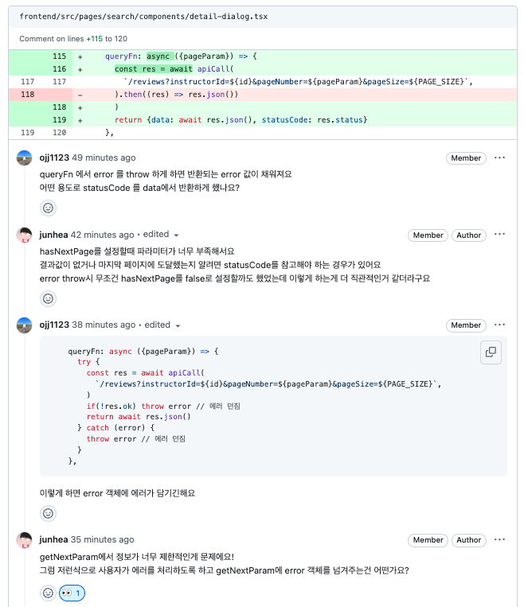
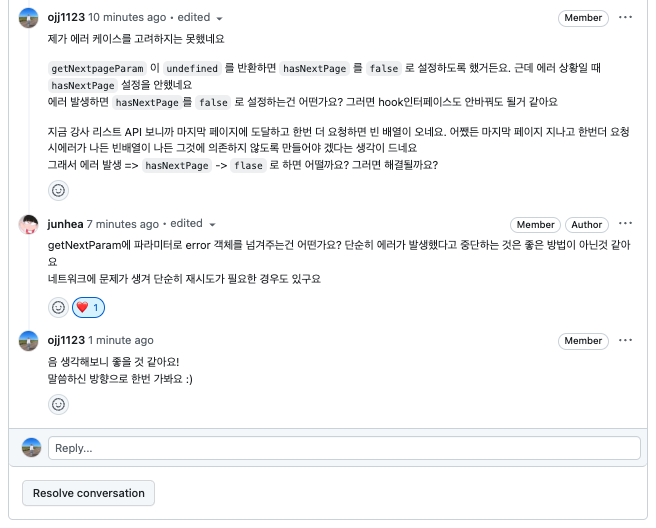

2024년 첫 두달을 숨가쁘게 달려왔다. 추가합격으로 운좋게 현대자동차 소프티어 부트캠프에 참여해 9 to 6 로 매일 강남으로 출퇴근을 했었다. 교육을 받으며 기술적으로 얻어간 것도 있고 아쉬웠던 점도 분명히 있다. 여기서 무엇을 배웠고, 아쉬웠는지 돌아보며 3월을 어떻게 보낼지 계획해보려고 한다.

# 👋 1월에는 무엇을 했냐면요,
## ✅ 공통 교육: 기획, 디자인 직군이 일하는 방식 톺아보기
### 프러덕트 개발자로서의 고민
소프티어 시작하고 1주일 간 개발 외 기획, 디자인, 데이터 분석 수업을 들었다. 현장에서 10년정도 일하신 기획, 디자이너 분들의 좋은 말씀들을 들을 수 있었다. 
이 교육을 들으며 가장 해소하고 싶었던 궁금증은 '기술이라는 토끼굴에 빠지지 않는 방법'이었다. '그밈'이라는 서비스를 만들며 처음에는 기술적인 학습을 목표로 접근했었다. 그러면서 작년 5월 이런저런 사용성을 개선해 v2를 런칭하였고, 7 ~ 8월쯤 바이럴을 타며 사용자들이 제법 많이 사용했다. 그러나 여기서 아쉬웠던 점은 '프러덕트에 대한 고민'을 놓쳤던 점이다. v2이후 새로운 기능 개발을 하기로 했으나 기술 학습으로 인한 지연, 취업 준비 등으로 결국 구현하지 못했다. (물론 스프린트 기간이 길어 긴장감있게 기능 개발이 이루어지지 못했다. 팀 운영 측면에서도 아쉬운 점이 있다.)
공통 교육을 듣고 다음과 같이 자문했다.

> "그밈을 만들며 프러덕트에 대한 고민을 했는가?"

6개월 이상 서비스를 운영하며 기능 추가/개선을 통해 프러덕트가 성숙기에 들어갔다. 그러면서 복잡도가 올라가고 이를 잘 조율하기 위한 고민이 필요했다. 하지만 그 시기를 놓쳤고 현재 '그밈' 프러덕트에 대한 아쉬움이 남아있다. 실무에서 프러덕트 개발자로서 어떤 고민을 해야할지 생각해볼 수 있었다.

> 1. 프러덕트를 이해하고 why를 고민하며 일하는 방법
> 2. 프로젝트를 효과적으로 운영하는 방법


> 공통 교육을 들으며 강사님께 드린 질문, 그리고 답변
> *"어떻게 하면 토끼굴에 빠지지 않을 수 있을까요?"*
> 

### 데이터 분석 세미나
이 외에도 GA 데이터 분석 세미나 들었다. 서비스를 기획하면서 데이터 설계가 함께 이루어져야 한다는 말이 인상깊었다. 실제 운영되고 있는 서비스를 뜯어보며 데이터 설계를 직접 했다. 짧은 시간이지만 데이터 기반으로 유의미한 분석 결과를 얻고 프러덕트를 성장시킬 수 있는 방법을 터득할 수 있었다.

### 커뮤니케이션 세미나
현장에서는 당연하게도 혼자 일하지 않는다. 그렇기 때문에 다른 사람과 "잘" 일할 수 있는 방법을 고민해보아야 한다.
실무에서는 어떤 소프트 스킬이 필요할까?

> 1. 명확하지 않은 것에서 지엽적인 내용을 걸러내는 능력
> 2. 복잡한 논리나 추상적인 개념을 쉽게 설명하는 능력
> 3. 타인을 공감하는 능력

세미나에서 기억나는 내용은 위 내용정도이다. 1, 2번은 나한테 부족한 역량들이다. 특히 면접 자리에서 실무진들과 이야기를 할 때면 설명이 길어지거나 핵심을 알기 힘든 말들을 하곤 했었다. 솔직하게 내 모습을 보여주기보다 '나를 더 잘 포장'하는 것에 급급했던 거 같다. 면접준비를 하면서도 커뮤니케이션 세미나에서 배우고 느꼈던 부분을 되새기고 가야겠다.


## 🧑‍💻 직무 교육: 내가 무엇을 알고 모르는지 돌아보기
직무 교육때는 웹 프론트엔드에 관한 내용을 학습했다. HTML, CSS, JS 부터 해서 React, 최적화, 상태관리, 웹 기초 등을 학습했다. 직무 교육을 통해 알고 있는 것과 모르고 있는 것을 돌아보는 자세를 취하려 했던거 같다.
### 배운점: 아키텍처 설계
> 프론트엔드의 폴더 구조가 곧 아키텍처

직무교육을 하며 아키텍처 설계에 집중했다. 특히 프론트엔드는 폴더구조가 곧 아키텍처이기 때문에 직관적이고 관심사 분리가 적절하게 이루어진 폴더구조를 만들 필요가 있다. 어떤 기준으로 폴더구조를 나눌까?

> 1. 어떤 방식으로 작업하는지 관점에서 설계
> 2. 데이터의 흐름을 파악할 수 있도록 설계
> 3. 적절한 관심사 분리가 이루어진 설계

평소 프로젝트를 하면서 인지하지는 못했지만 결과적으로 보면 위와 같이 설계해왔다. 예를 들어, 작업의 순서가 **"기본 컴포넌트 구현 -> 페이지 구현"** 이라면, components 폴더에 기본 컴포넌트를 모아두고 pages 폴더에 페이지 컴포넌트를 작성하는 것이다.

```markdown
/components
/pages
```

아니면 작업방식이 **"기본컴포넌트 없이 페이지로 나누어 각 페이지에 필요한 hook이나 컴포넌트를 만든다"** 면 아래와 같이 폴더구조를 설계할 수 있을 것이다

```markdown
/pages
	/home
		index.tsx
		/components
		/hooks
	/aboutus
		index.tsx
		/components
		/hooks
```

아니면 위 두 방식을 섞어서 사용할 수도 있겠다. 이처럼 **팀의 작업 방식에 따라 폴더구조를 결정할 수 있다.**

또한 데이터의 흐름을 파악할 수 있는 설계도 학습해보았다. 프론트엔드에서는 데이터(=state)를 화면(=UI)에 보여주는 것이 가장 중요하고, 이를 위한 상태 관리 전략을 고민해야한다.
당시에 Flux 패턴이 가장 먼저 떠올랐다. Flux 패턴을 개념적으로만 알고 있어서 이번 기회에 직접 구현해보고자 했다. Flux패턴은 어플리케이션이 커짐에 따라 MVC모델의 복잡함을 피하기 위한 대안으로 나온 패턴이다. '단방향 데이터 흐름'이라는 컨셉을 가지고 있고 Redux의 시조가 되는 패턴이다.

> **Flux 패턴**
> 1. View는 Store를 반영한다.
> 2. View에서 Action이 발생한다. (예를 들어 사용자가 버튼을 클릭하는 행위)
> 3. Dispatcher를 통해 Store를 업데이트된다.
> 4. 업데이트된 Store가 View에 반영된다.
> 
> 

바닐라 자바스크립트로 [Redux 의 `createStore` API 와 비동기 처리를 위해 미들웨어인 redux-thunk 코드를 보며 직접 구현해보았다.](https://github.com/ojj1123/fancy-fe-todo/pull/2) 직접 구현해보며 느꼈던 장단점이다.

> **장점**
> - 어플리케이션의 전체 데이터 흐름이 눈으로 보인다
> - store 가 변경되면 view 에 반영되기 때문에 UI에 '데이터(=상태)'를 표현하는 방식(What)만 고민하면 된다. 즉, 선언적으로 코드를 작성할 수 있다
> - 상태로직(비동기 로직 포함)을 따로 분리하여 view를 순수하게 유지할 수 있다. 순수해진 뷰는 같은 input에 같은 output을 내므로 테스트하기 쉬운 코드가 된다.
> 
> **단점**
> - 기능별로 리듀셔를 나눌 수 있긴 하지만 어쨌든 single store를 이용한다. 어플리케이션이 커지면 이 store가 비대해질 수 있겠다는 생각이 들었다.
> - 비동기 로직을 위한 미들웨어 구현이 함수형 기법을 이용하고 있다. redux-thunk는 커링(currying, 함수를 반환하는 함수)을 이용한 미들웨어이다. 커링은 클로저를 알고 있어야 한다. 이 부분에서 복잡하다는 생각이 들었다.

이밖에도 [비동기 처리 즉, 서버 상태를 처리하기 위해 미들웨어가 적합한지도 고민해보았다.](https://github.com/ojj1123/fancy-fe-todo/pull/5)
상태관리 솔루션으로 Redux 말고도 zustand, recoil, jotai 등 다양한 라이브러리가 있다. 또한 `SWR`, `@tanstack/react-query` 와 같이 서버 상태를 다루는 라이브러리도 있다.
**이번 교육을 통해 앞으로 프론트엔드 개발을 하며 어플리케이션의 상황에 따라 적합한 아키텍처를 설계할 수 있겠다는 자신감이 생겼다.**

### 아쉬운 점
> 최신 기술을 잘 알고 활용할 수 있다. 그러나 부족한 기초를 매꿔야 한다

교육을 들으며 생각보다 기초가 부족하다는 걸 깨달았다. 특히 웹 기초 내용이 부족함을 느꼈다. 프론트엔드 개발자이지만 백엔드에 대한 이해가 필요하다고 생각한다. 그래야 어플리케이션의 전체 흐름을 이해할 수 있으니 말이다. 아래 내용에 대한 추가 학습이 필요하다.

> **웹**
> - HTTP1/2/3 버전별 변경 사항 (각 버전은 무슨 문제를 해결하고 있는가?)
> - 쿠키(Cookie), 세션(HTTPSession)
> - 캐시와 조건부 요청 관련 헤더(cache-control, stale-while-revalidate)
> - 웹 보안 (TLS, 대칭키/비대칭키 암호화)
> - 인증 / 인가, OAuth


# 💡 2월 - 최종 프로젝트

2월부터는 최종프로젝트를 시작했다. 백엔드 3명, 프론트 2명으로 팀이 이루어졌다. 프로젝트 시작 전 목표를 설정했다.

> 1. 몰입의 즐거움 느끼기
> 2. 깊게 공부하기, 의미있는 코드 작성하기
> 3. GA 적용해보기

결과적으로 말하면 3번은 해보지 못했다. 생각보다 한달이라는 시간이 짧았다. 기능 구현, 최종 PPT 준비만 하기에도 벅찼다. 최종프로젝트를 하면서 배운점과 아쉬운점을 적어보려고 한다.

> 최종 프로젝트 결과물 보러가기
> 👉 [Github](https://github.com/softeerbootcamp-3rd/Team1-driving-today)

### 배운점 1️⃣ : 잘 설계된 소프트웨어는 개발 생산성을 올려준다

이번 프로젝트에서 가장 공들였던 부분이다. 지속할 수 있는 소프트웨어에 관심이 많아 react 컴포넌트나 hook 관련 디자인 패턴을 적용하며 공부했던 경험이 있다. 이번 프로젝트에서 그동안 공부했던 디자인 패턴과 아키텍처 설계를 적용해보며 궁극적으로 팀에 어떤 영향을 줄수 있는지 고민해보았다.

> 잘 설계된 컴포넌트나 Hook은 개발 생산성을 올려준다.

프로젝트를 하면서 느꼈던 부분이다. '내가 만든 함수'를 다른 개발자가 어떠한 인지부하 없이 사용할 수 있다면 얼마나 편할까. 동료가 '내가 만든 함수'를 사용하기 위해 그 함수의 코드를 뜯어봐야 한다면 얼마나 불편할까. 코드를 작성하는 매 순간 이런 고민을 했다. 팀원이 작성한 코드를 보면서도 마찬가지다.

> 코드리뷰를 하면서 컴포넌트, hook을 "사용하는" 개발자 관점에서 리뷰를 했다.
> *"어떤 점이 편한가?"*
> *"개선할 점은 없을까?"*
> *"이 컴포넌트를 사용하면 내가 얻는 이점은 무엇일까?"*
> 


### 배운점 2️⃣ : 피드백과 개선 경험

> 피드백과 점진적 개선. 애자일의 핵심

아무리 잘 설계했다 하더라도(그저 잘 설계했다고 믿을 뿐이다) 실제로 컴포넌트나 hook을 사용하면서 개선한 점이 생기곤 했다. **처음부터 완벽한 설계는 없으며 피드백과 개선을 반복하는 것이 최선이라는 것을 배웠다.**

무한스크롤 로직을 추상화한 `useInfiniteFetch` 을 설계하며 개선했던 사례가 있다. 처음 설계에서는 무한 스크롤 시 발생할 수 있는 error case를 생각하지 못했다. 무한스크롤 시 에러가 발생하면 어떻게 동작해야할지 고려하지 못한 것이었다.

> 오류(네트워크 오류, 백엔드API 에러)가 나면,
> 1. 무한 스크롤을 멈춘다.
> 2. 재요청을 할 수 있다.
> 3. 재요청을할 수 있다. 또한 에러 상태에 따라 재요청 동작을 커스텀할 수 있다.

2번 방식을 선택했다. 오류 발생 시 사용자에게 재요청을 할 수 있도록 하자는 의견때문에 1번을 반려했다. 에러 상태에 따라서 재요청 동작을 커스텀하는 건 아직은 불필요하다고 생각해 3번 또한 반려했다.
이처럼 기획과 use case 를 따져보며 처음 만들었던 hook을 개선해보았다.




### 배운점 3️⃣ : 커뮤니케이션 스킬

> **양보하는 마음을 가진 사람** 그리고 **동료의 뒤를 책임져줄 수 있는 사람**

이 부분은 이전에 [linkedin에 남겼던 댓글](https://www.linkedin.com/feed/update/urn:li:activity:7143235802355933184?commentUrn=urn%3Ali%3Acomment%3A%28activity%3A7143235802355933184%2C7152305146243223552%29&dashCommentUrn=urn%3Ali%3Afsd_comment%3A%287152305146243223552%2Curn%3Ali%3Aactivity%3A7143235802355933184%29)로 대신한다


### 아쉬운 점
- 기획력 부족, 떨어진 완성도
개발자만 모여서 프로젝트를 하다보니 기획 부분에서 부족한 부분이 많았다. GA도 달아보면서 데이터 설계도 해보고 싶었으나 개발만 하기에도 빠듯했다. 또 개발에 집중한 나머지 QA과정을 못거쳤고, 기능 명세와 정책에서 허술한 부분을 발견하지 못했었다. 최종발표에서 기획 관련 질문은 없었지만 개인적으로 프러덕트에 대한 고민을 못한 것이 아쉽다.

- 테스크 코드 부재
**점진적으로 개선하기 위해서는 테스트코드가 필요하다**는 걸 느꼈다. 코드를 수정하면서 기존의 동작이 정상적으로 동작하는지 확인해야하기 때문이다. 테스트 코드를 작성해본 경험이 없었고 테스트 코드까지 작성할 여유가 없었다. 그러나 왜 테스트 코드가 중요한지 인지했기 때문에 개인 프로젝트를 하며 테스트 코드를 작성해보려 한다.

---

무엇보다도 팀원들이랑 1달간 9 to 6로 동거동락하며 프로젝트를 했다. 또한 **무언가 몰입할 수 있는 환경에 놓인다는게 행복하다는 걸 느꼈다.** 물론 다른 팀과 경쟁 구도가 생겨 가끔은 조급함이 생기기도 했다. 그럼에도 가장 좋아하고 잘하는걸 집중해서 할 수 있는 환경이었고 이때만큼은 항상 자신감에 차있었다. 언제 또 이런 경험을 해볼 수 있을지 ... (이젠 회사에 들어가야겠지?)


# 3월에 집중해야 할 것

1, 2월 힘차게 달려왔으니 3월에 할 일도 계획해보려 한다.

> 1. resume 정리 및 자기소개서 작성
> 2. 면접 준비
> 3. CS 학습
> 4. 개인 프로젝트 - 오픈소스 만들기

### resume 정리 및 자기소개서 작성

> 자신있게 말할 수 있는 내용으로 채우기

3월달이라 계속 공채가 올라오고 있다. 3월 초까지 resume를 정리해서 회사에 지원해보려 한다.
얼마전 부트캠프 프론트엔드 강사였던 크롱과 모의 면접을 하며 이력서를 다시 돌아보았다. **'정말로 자신있게 대답할 수 있는 내용'으로 채워야 하고 모든 내용에 대해 대비가 되어 있어야 한다는 피드백을 받았다.** 이는 신뢰감으로 이어질 수 있다는 말씀도 해주셨다. 자기소개서도 마찬가지로 내가 정말 자신있게 대답할 수 있는 내용으로 작성해보려 한다.

### 면접 준비
> 면접 경험은 최대한 많이 해보기

resume와 자기소개서를 작성하고 3월 중순/말부터 회사에 지원해보려 한다. **2023 하반기 준비하면서 '면접' 내공이 많아야 함을 느꼈다.** 그렇다고 무작정 '이력서를 남발'하면 안된다. 회사에 대한 조사와 내가 하고 싶은 것이 무엇인지 고민해보면서 회사에 지원해볼 생각이다.

> 액션 아이템
> 1. 면접 경험 쌓아나가기
> 2. 이력서 남발 X
> 3. 회사에 대한 조사, 내가 하고 싶은 것 고민

### CS 학습

> 하루 2시간씩 조금씩 매일 하기

**조금씩 하더라도 꾸준하게 하는게 중요하다.** 소프티어 부트캠프하면서 부족하다 느낀 내용을 채워나갈 예정이다.

> 공부할 것들
> 1. 웹 기초
> 2. 알고리즘 문제풀이

### 개인 프로젝트

> 개인 프로젝트 레포
> 👉 [Github](https://github.com/ojj1123/react-useful)

전부터 오픈소스를 만들고 싶다 생각했고 이번 기회에 조금씩 시작해보려 한다. 주요 과제는 아래와 같다

> 1. 테스트 코드 작성
> 2. 모노레포 환경 구성 및 npm 배포