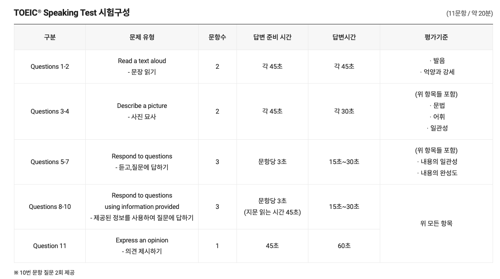

 https://youtu.be/7RXFQH6WlUg?si=dW8_yhTkCyH2OhSH
- 만능답변 많이 준비해야함(동문서답X)
- 이론과 실전 같이 준비 -> 녹음하고 모범답안과 대조
- 동일한 문제를 부족한 부분을 매꿔서 답해보기

## 공부 루틴
- DAY1 파트1, 파트2 이론 정복
	- 파트1 발음 강세 억양, 기초, 3세트 정도 풀고 모범답안 쉐도잉
	- 파트2 템플릿, 표현 암기 / 5세트 연습
- DAY2 파트4 마스터, 파트2 문제풀이
	- 파트4의 5가지 빈출 표 유형 익히기
	- 파트4 답변 팸플릿 익히기
	- 파트4 듣기 문제 패턴
	- 파트4 실전 모의고사 10세트
	- 파트2 실전 문제 10세트
- DAY3 파트3 마스터
	- 유형 정리
	- 만능 문장 50 숙지
	- 실전모의고사 20세트 풀기
- DAY4 파트6 마스터 - 어려움
	- 유형설명듣기, 템플릿 익히기
	- 만능문장암기
	- 실전연습20세트하면서 적용
- DAY5 파트3와 파트6 복습
	- 각각 10세트씩
	- 문제 풀면서 만능문장 재확인 및 아이디어 정리
- DAY6 실전 연습
	- 모의고사 5세트
	- 녹음해서 모범답안과 대조하고 틀린부분 복습(만능문장과 템플릿, 문법상 실수, 동문서답 등 확인)
	- 동일한 문제를 잘 하는 버전으로 한번더 풀어보기
- DAY7 시험당일
	- 3세트정도 풀기
	- 템플릿과 만능문장 발음신경써서 여러번 읽기 
	- 신분증, 물, 읽을 템플릿, 재학증명서(학교할인 받음)

## 공부자료
1. . DAY 1
	PART 1 & 발음 무료강의: [https://youtu.be/90WyKqxgszE](https://www.youtube.com/watch?v=90WyKqxgszE) 
	PART 1 빈출 단어 쉐도잉 영상: [https://youtu.be/5iG99SwLrhc](https://www.youtube.com/watch?v=5iG99SwLrhc) 
	PART 2 영상 하나로 끝내는 파트2 개정판 무료강의: [https://youtu.be/FC1xOMQLvtQ](https://www.youtube.com/watch?v=FC1xOMQLvtQ) 
		기초가 부족한 분들을 위한 파트2 추가 강의 2편 ( 개정 전 영상이라 답변시간이 30초로 변경된 점만 주의해서 시청 해주세요)
		1편 [https://youtu.be/JH6sFGGQZMk](https://www.youtube.com/watch?v=JH6sFGGQZMk) 
		2편 [https://youtu.be/BqRVyMtlUoY](https://www.youtube.com/watch?v=BqRVyMtlUoY) 
	PART 2 빈출 표현 쉐도잉 영상: [https://youtu.be/nIup6_Xe7Xo](https://www.youtube.com/watch?v=nIup6_Xe7Xo) 
	
2. DAY 2
	PART 4 영상하나로 끝내는 파트4무료강의: [https://youtu.be/QYgfYk9Ysys](https://www.youtube.com/watch?v=QYgfYk9Ysys)

3. DAY3
	PART 3 만점 비법 영상: [https://youtu.be/wWzNGMnOYSI](https://www.youtube.com/watch?v=wWzNGMnOYSI)
	PART 3 영상 하나로 끝내는 파트3 무료강의 : [https://youtu.be/dlQ95wyC5kc](https://www.youtube.com/watch?v=dlQ95wyC5kc)
	PART 3 (만능문장 50): [https://youtu.be/tdGCKI48Sjk](https://www.youtube.com/watch?v=tdGCKI48Sjk) 

4. DAY 4
	 PART 5 영상하나로 끝내는 파트5 무료강의(개정 전 파트6): [https://youtu.be/B5PKsMxufGI](https://www.youtube.com/watch?v=B5PKsMxufGI) 
	 PART 5 만능 문장: [https://youtu.be/P43wDlScjIs](https://www.youtube.com/watch?v=P43wDlScjIs) 

5. DAY 6
	실전 모의고사 1회: [https://youtu.be/rqTLeyRPAOs](https://www.youtube.com/watch?v=rqTLeyRPAOs) 
	실전 모의고사 2회: [https://youtu.be/jwpv5ZDB_Ug](https://www.youtube.com/watch?v=jwpv5ZDB_Ug) 
	실전 모의고사 3회: [https://youtu.be/XKwJPmgCRtY](https://www.youtube.com/watch?v=XKwJPmgCRtY) 
	실전 모의고사 4회: [https://youtu.be/tjqO1Nh0F8w](https://www.youtube.com/watch?v=tjqO1Nh0F8w) 
	실전 모의고사 5회: [https://youtu.be/NbWU6p74GgY](https://www.youtube.com/watch?v=NbWU6p74GgY)

- 파트3, 파트5 만능문장
https://drive.google.com/drive/folders/1g_RrXAvmPZHGyQBhLh5Yr6U4DH9Yt3IX

https://youtu.be/5i2DI__8wVI?si=7MZcg_bVon5TCqJk

