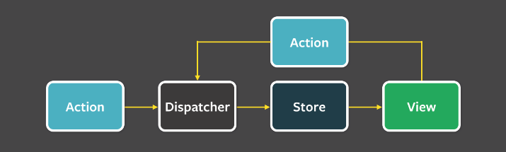

[리액트 상태 관리 라이브러리, 어떤 것을 써야 할까?](https://yozm.wishket.com/magazine/detail/2233/)

# Redux

- Flux 패턴
- 단일 저장소 ([Flux](Flux.md) 구현체는 다중 저장소를 사용함)
- 리액트 런타임 내부가 아니라 외부 모듈 상태를 이용함
- 장점
	- 기존 MVC 모델의 단점이었던 model과 view의 n:n 결합으로 인한 예측하기 힘든 데이터 상태 문제를 해결해줌 -> flux 패턴을 통해 단일 데이터 흐름으로 예측가능한 데이터 흐름
- 단점
	- 보일러플레이트
	- 비동기 통신을 위해 thunk와 saga를 이용해야하나 러닝커브가 있음
	- 비동기 통신이 필요한 서버 상태를 다루기 위해 캐싱, race condition 문제 해결, revalidate, deduping requests, retry 등이 필요한데 이를 구현하기 위해 보일러 플레이트가 증가함
	- 상태가 많아지면 단일 스토어가 비대해져 런타임 성능 #최적화 가 어려워짐

- Saga
	- generator 사용

# SWR, React query
- 서버 상태 관리 라이브러리 등장


---

https://npmtrends.com/jotai-vs-recoil-vs-zustand
# Recoil
- useState-like API
- 원자(atom) 상태로 훅을 통한 상태 관리, 원자 상태의 변경을 감지에 view로 전달할 수 있음 (Recoil의 `useRecoilState` hook)
- 모놀리식 상태 관리에서 점진적으로 분산해서 상태를 관리함
- 내부적으로 캐싱을 지원함. 동일한 atom에 대한 내부적으로 메모이제이션 함
- 원자 상태를 파생 상태를 형성하기 위해 함께 연결할 수 있음
	- [파생상태](파생상태.md) : 이미 정의된 상태를 통해 계산할 수 있는 다른 상태
	- selectors 를 통해 파생상태를 구할 수 있음
	- selector는 idempotent(멱등성) 함수임 => 여러번 연산을 해도 같은 결과를 냄 => 캐시에 용이
	- **다른 atom, selector간 의존관계를 추적하기 때문에 셀렉터 함수를 업데이트 함**
	- **어떤 컴포넌트가 selector를 사용하는지 추적해 리렌더링을 시켜줌**
- 단점
	- 아톰과 셀렉터가 많아지면 의존관계가 복잡해져 점점 예측하기 어려워짐 => container-presentation 구조를 통해 상태를 관리하는 부분과 보여주는 부분을 나누어 갈 수 있겠음. 커스텀 hook으로 비즈니스 로직을 묶어서 해결해보면 좋을거 같음
	- atom이 자주 바뀐다면 캐시하는 것이 오히려 성능 저하로 이어질 수 있음

# Jotai


# Zustand
[React 상태 관리 라이브러리 Zustand의 코드를 파헤쳐보자](https://ui.toast.com/weekly-pick/ko_20210812)

- 간결한 flux 원칙
- 리액트에 종속하지 않는 라이브러리(unopinionated library)
- 발행/구독 모델(pub/sub)
	- 스토어가 변경될 때 실행할 리스너를 등록했다가, 스토어의 상태 변경이 일어날 때 등록된 리스너에게 상태가 변경되었다고 알려준다
- 클로저를 이용해 구현되어 있다 => 상태 변경, 조회, 구동 등의 인터페이스를 통해서만 스토어를 다루고 실제 상태는 애플리케이션 생명주기 전체에 걸쳐 의도치 않게 변경되는걸 막을 수 있다
- provider 필요없음. 그러나 상태를 구독하고 있는 컴포넌트를 리렌더링 해줄 수 있음
- 간단한 API => 러닝커브가 낮음
	- 리코일은 atom을 변경하기 위해 컴포넌트 안에서 setXXX 을 사용함
	- 반면 주스탄드는 스토어에서 바로 상태 변경 가능
```js
import { create } from 'zustand'

const useStore = create((set) => ({
  bears: 0,
  increasePopulation: () => set((state) => ({ bears: state.bears + 1 })),
  removeAllBears: () => set({ bears: 0 }),
}))


function BearCounter() {
  const bears = useStore((state) => state.bears)
  return <h1>{bears} around here...</h1>
}

function Controls() {
  const increasePopulation = useStore((state) => state.increasePopulation)
  return <button onClick={increasePopulation}>one up</button>
}
```
- 리액트에 종속되지 않기 때문에 일시적 업데이트([](https://github.com/pmndrs/zustand#transient-updates-for-often-occurring-state-changes))를 지원함
	- 자주 바뀌는 상태에 대해 매번 리렌더링하지 않도록 제어가능
- 장점
	- 간단한 API
	- 특정 라이브러리에 종속적이지 않다
	- context 를 사용하지 않아 **불필요한 리렌더링을 제어**해줄 수 있다
	- [transient-updates](https://github.com/pmndrs/zustand#transient-updates-for-often-occurring-state-changes) 를 지원해줘서 자주 바뀌는 상태를 직접 제어해줄 수 있다
- 단점
	- 성능이 중요한 앱에서는 탑다운 방식은 적합하지 않음
	- 레퍼런스 많이 없다


탑다운 방식(하향식) : 전체적인 오버뷰에서 디테일 세부사항으로 스토어 모델링을 하는 것 - Redux, zustand
바텀업 방식(상향식) : 성능에 중요한 앱 - recoil, jotai
