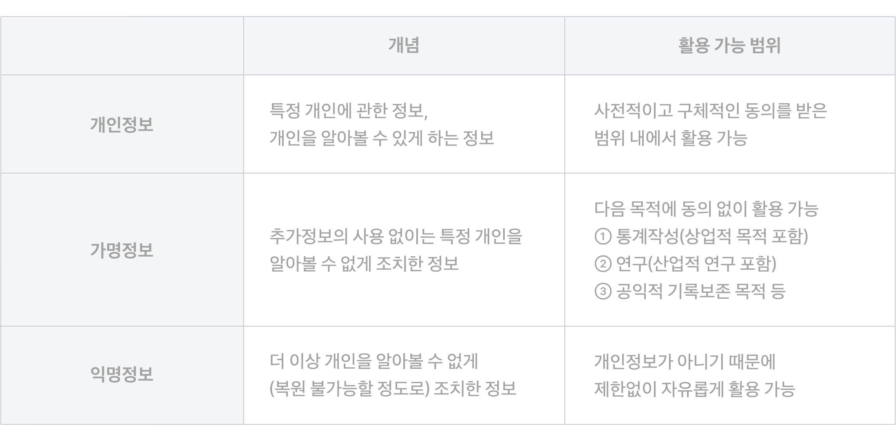

개인정보보호법/정보통신망법/신용정보법 개정안. 개인정보 보호에 관한 법이 소관 부처에 따라 나뉘어 있어 중봅 규제가 발생하는 것을 막고 개인과 기업이 정보를 활용할 수 있는 폭을 넓히자는 취지에서 발의됨. 2020년 1월에 국회를 통과해 8월부터 시행.
데이터 3법에서 주목해야할 내용은 아래 두가지
- 개인정보 보호 강화
	- 폭넓은 의미의 개인정보를 개인정보, 가명정보, 익명정보로 나누고 보호해야하는 개인정보의 범위를 구체화
	- 데이터만으로 누구인지 특정하기 어려운 [가명정보](가명정보)와 [익명정보](익명정보)는 기업이 활용할 수 있음
	- 대신 국가가 지정한 기관에서만 [데이터 결합](데이터%20결합.md)가능 -> [데이터전문기관](데이터전문기관.md), [결합전문기관](결합전문기관)
- [마이데이터](마이데이터.md) 도입
	- [마이데이터](마이데이터.md)란 개인이 데이터를 주체적으로 관리하는 것을 넘어 능동적으로 활용하는 일련의 과정
	- 신용정보법 개정안에 포함된 '[개인신용정보 전송요구권](개인신용정보%20전송요구권)'도 마이데이터 활동의 일종이라 할 수 있음

