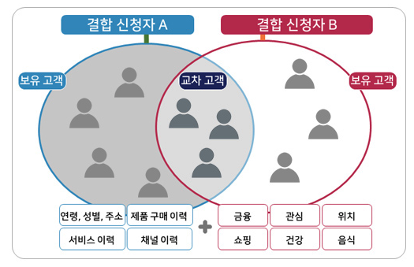

데이터 결합 방법
- 법인(기관, 개인정보처리자, 결합신청자)가 보유한 고객의 정보(개인정보)를 개인이 실벽되지 않도록 가명처리
- 개인정보와 달리 [가명정보](가명정보)는 개인의 동의를 받지 않고도 다른 법인의 가명처리된 정보와 고객별 속성정보를 결합 할 수 있음
- 이때 데이터 결합을 할 때는 국가에서 지정한 기관에 의뢰해서 결합해야함 [데이터전문기관](데이터전문기관.md), [결합전문기관](결합전문기관)